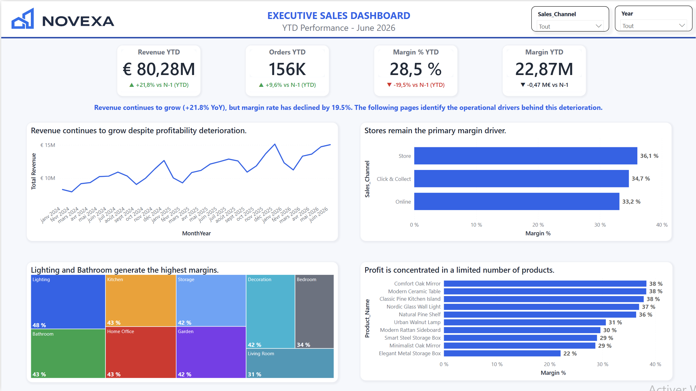
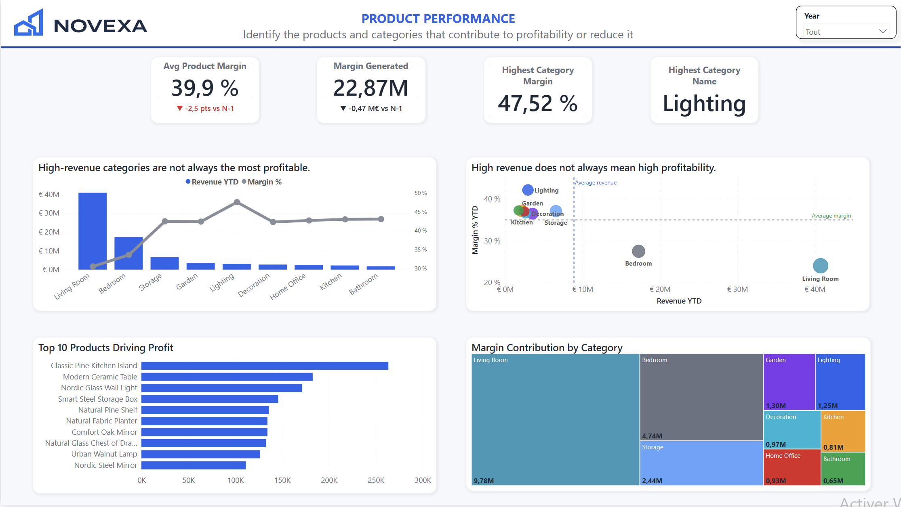

# NOVEXA Home Analytics

A personal project on sales and profitability for a fictional home furnishing retailer.

I built this project to apply my Data Analytics skills to a business problem close to my previous experience in sales and purchasing. The dataset is synthetic.

## Business problem

NOVEXA Home sells furniture and home decoration through stores, an online shop and Click & Collect.

Revenue and order volume are growing. At the same time, profitability is getting worse. The objective of the analysis is to understand why the margin rate is falling, and why margin in euros goes down even though sales keep growing.

## Dataset & approach

The data is synthetic. It was created to simulate a realistic retail performance scenario.

It covers January 2024 to June 2026. 2026 only includes the first half of the year, so yearly comparisons use January–June in each year.

The model is a simple star schema: one sales fact table (750,000 rows) and six dimensions (date, product, customer, store, supplier, warehouse).

I defined a small set of KPIs (revenue, orders, margin €, margin rate, discount), calculated them in SQL, then built a Power BI report to explore the results.

## What I found

January–June figures:

| Year | Revenue | Orders | Margin rate | Margin € |
|------|---------|--------|-------------|----------|
| 2024 | €55.22M | 130,615 | 40.05% | €22.11M |
| 2025 | €65.93M | 142,047 | 35.40% | €23.34M |
| 2026 | €80.28M | 155,740 | 28.49% | €22.87M |

In 2026, revenue is higher than in 2025, but margin in euros is lower.

**Costs are rising faster than selling prices.** Between 2024 and 2026 (January–June), the average unit cost to unit price ratio moved from 0.58 to 0.68. That puts significant pressure on margin.

**Living Room brings a lot of revenue, but at a low margin rate.** In January–June 2026 it is the largest category by revenue (about €40.8M) with a margin rate of about 24%.

**Discounts are increasing.** The average discount rate went from 2.88% in 2024 to 4.10% in 2025 and 5.62% in 2026 (January–June).

Online sales are also a larger share of revenue (about 23% in 2024 to 34% in 2026). In 2026 the online margin rate is a bit lower than in store (about 27% vs 29%), and discounts are higher online. This plays a role, but it does not explain the full drop in margin rate on its own.

## Power BI dashboard

The Power BI report has five pages: an executive view, sales, products, stores, and a short summary.

The executive page shows the gap between revenue growth and margin. The product page shows how categories differ on revenue and profitability.





The file is in `powerbi/Novexa_Analytics_v001.pbix`.

## Recommendations

- Track purchase cost against selling price more closely, especially where cost has grown faster than price.
- Start with Living Room: it is the biggest category and the least profitable on rate.
- Review how often discounts are used, in particular where they are already highest.

## Technical details

Python/Pandas → SQLite/SQL → Power BI.

CSV files are generated with Python, loaded into SQLite, checked with SQL queries, then used in the Power BI report.

```bash
python3 -m venv .venv
source .venv/bin/activate
pip install -r requirements.txt
python generate_dataset.py
python create_database.py
```

## Limitations

The dataset is synthetic and was designed to look like a typical retail situation, so the patterns above are expected as well as measured. This is a descriptive analysis: there is no forecast. 2026 stops in June, and store or customer splits should be read with care, because those links in the sales table are largely random.
