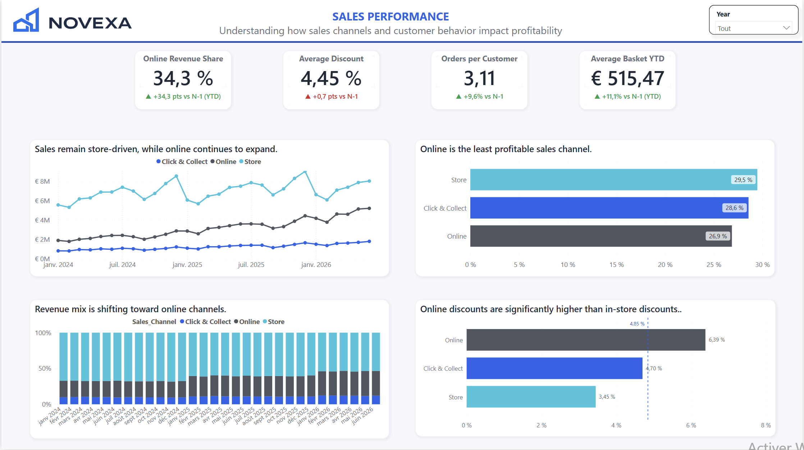
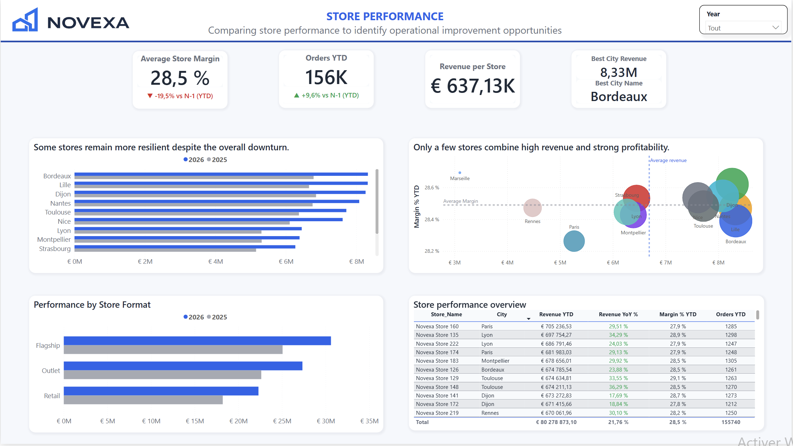
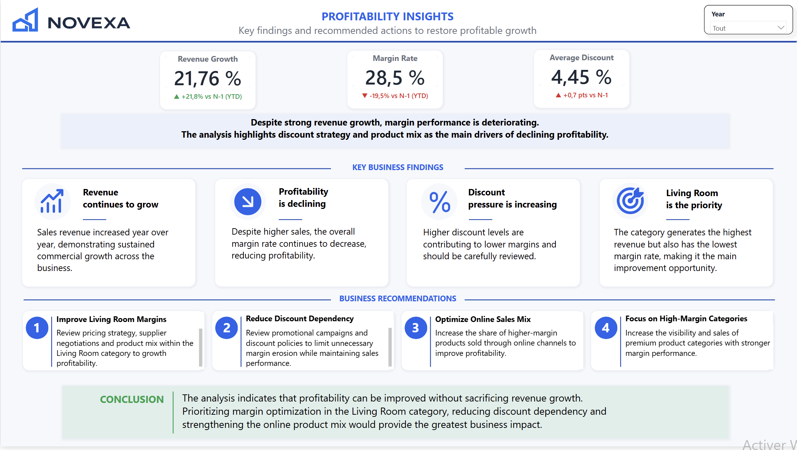
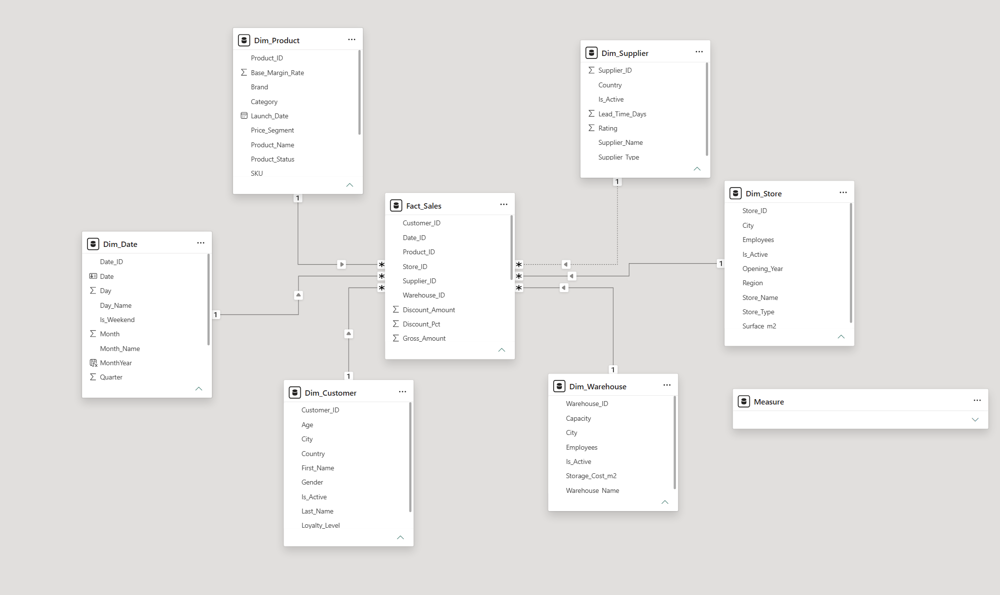

# NOVEXA Home Analytics 
# An end-to-end Data Analytics portfolio project built with Python, SQL and Power BI.

<p align="center">
    
</p>


## Project Overview

NOVEXA Home Analytics is an end-to-end Data Analytics portfolio project simulating a national home furnishing retailer.

The objective of this project is to investigate why profitability declined despite continuous revenue growth by combining Python, SQL and Power BI.

This project demonstrates the complete workflow of a Data Analytics project, from data generation to business reporting:

- Data generation with Python
- Data modelling using a Star Schema
- SQL validation
- Data visualization with Power BI
- Business insights and recommendations

Python → CSV → SQLite → Power BI → Business Insights

---

# Business Context

NOVEXA is a fictional home furnishing company operating stores across the country as well as an online sales channel.

Although revenue and order volume continue to increase, management has noticed that overall profitability is gradually declining.

The objective is to identify the business drivers behind this trend and provide actionable recommendations based on data.

---

# Project Objectives

This project answers several business questions:

- How has revenue evolved over time?
- Why is profitability decreasing despite revenue growth?
- Which product categories contribute the most to profit?
- How do discounts impact overall margin?
- How do sales channels influence profitability?
- Which stores perform best?

---

# Dashboard Overview

The Power BI report is organised into five pages.

## Executive Sales Dashboard

Overall business performance with the main KPIs, revenue evolution and profitability trends.


---

## Sales Performance

Analysis of revenue by sales channel, customer behaviour, average basket and discount strategy.




---

## Product Performance

Analysis of product categories, margin contribution and profitability by product.


---

## Store Performance

Comparison of store performance across cities and store formats.



---

## Profitability Insights

Summary of the main findings and business recommendations.



---

# Data Model

The Power BI data model follows a Star Schema with one fact table and six dimension tables.

**Fact Table**

- Fact_Sales

**Dimensions**

- Dim_Date
- Dim_Product
- Dim_Customer
- Dim_Store
- Dim_Supplier
- Dim_Warehouse




---

# Tech Stack

| Tool | Purpose |
|-------|----------|
| Python | Dataset generation |
| Pandas | Data generation & manipulation |
| SQLite | Database |
| SQL | Data validation |
| Power BI | Dashboard & DAX |
| Git & GitHub | Version control |

---

# Repository Structure

```
novexa-home-analytics
│
├── assets/
├── data/
├── database/
├── docs/
├── powerbi/
├── sql/
├── novexa_home_analytics/
├── tests/
├── README.md
└── requirements.txt
```

---

# How to Run

```bash
python3 -m venv .venv

source .venv/bin/activate

pip install -r requirements.txt

python generate_dataset.py

python create_database.py

pytest
```

---

# Key Business Insights

The analysis highlights several important findings:

- Revenue and order volume increased throughout the analysis period.
- Profitability declined despite sustained revenue growth.
- The Living Room category generated the highest revenue but the lowest margin rate.
- Increasing discounts contributed to the decline in overall profitability.
- Online sales became a major growth driver while putting additional pressure on margins.

---

# About This Project

This portfolio project was developed after completing the Le Wagon Data Analytics Bootcamp.

Its objective is to demonstrate practical Data Analytics skills through a complete end-to-end project, from data generation to business reporting.

The focus was placed on building a realistic business scenario and communicating insights through a clear and professional Power BI dashboard.